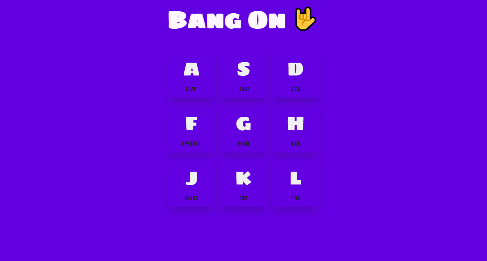

# A Drum Machine Using Vanilla JS

## Table of contents

- [Overview](#overview)
  - [The challenge](#the-challenge)
  - [Screenshot](#screenshot)
  - [Links](#links)
- [My process](#my-process)
  - [Built with](#built-with)
  - [What I learned](#what-i-learned)
  - [Continued development](#continued-development)
  - [Useful resources](#useful-resources)
- [Author](#author)
- [Acknowledgement](#acknowledgement)

## Overview

### The challenge

User should be able to create different drum sound by pressing the mentioned keys.

### Screenshot



- Solution URL: [Git Repo](https://github.com/moeen-mahmud/drum-kit)
- Live Site URL: [Live Site](https://sportsdb-api-js.vercel.app/)

## My Process

### Built With

- HTML5 markup
- JavaScript
- Document Object Model

### What I learned

By doing this project I learn about key events and keycode. Although, keyCode method has been depricated, that is why I used "key" method. I also learn how to control css transition animation.

```javascript
const keys = document.querySelectorAll(".key");
keys.forEach((key) => {
  key.addEventListener("transitionend", (e) => {
    if (e.propertyName !== "transform") return;
    key.classList.remove("playing");
  });
});
```

### Continued Development

This project is inspired from [Wes Bos's 30 JavaScript](https://javascript30.com/). I followed the process, but I implemented some of my own methods and styles. I will continue to solve the remaining project from now on.

### Useful resources

- [Mozilla Developer Network](https://developer.mozilla.org/en-US/)
- [JavaScript 30](https://javascript30.com/)

## Author

- Twitter - [moeen_mahmud](https://twitter.com/moeen_mahmud)

## Acknowledgement

A huge thanks to [Wes Bos's](https://javascript30.com/).
